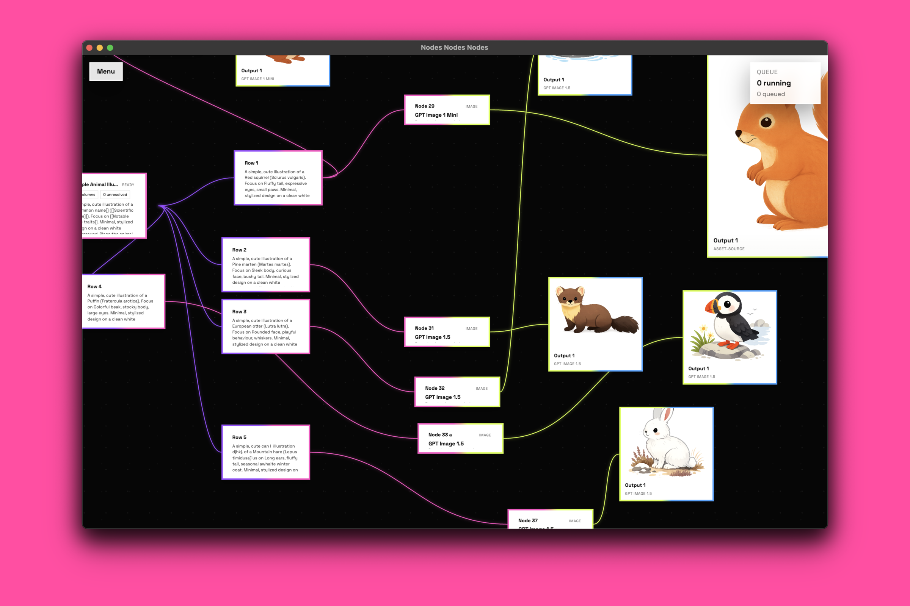

# Nodes Nodes Nodes

<p align="center">
  
</p>

Local-first desktop app for node-based media workflows.

`Nodes Nodes Nodes` is an Electron app for building generation and post-processing workflows on an infinite canvas, running jobs through multiple providers, and reviewing outputs in a fast local asset viewer.

## What The App Does

- create and switch between isolated local projects
- build workflows on an infinite canvas with model nodes, prompt notes, lists, templates, and asset nodes
- run image and text jobs through one provider-agnostic interface
- inspect queue state and provider request/response debug data
- review generated assets in grid, 2-up, and 4-up compare views
- rate, flag, tag, and filter outputs locally

## Current Provider Support

- OpenAI
  - `gpt-image-1.5`
  - `gpt-image-1-mini`
  - `gpt-5.4`
  - `gpt-5-mini`
  - `gpt-5-nano`
- Google Gemini
  - `gemini-2.5-flash-image` (`Nano Banana`)
  - `gemini-3-pro-image-preview` (`Nano Banana Pro`)
  - `gemini-3.1-flash-image-preview` (`Nano Banana 2`)
  - `gemini-3.1-flash-lite-preview`
  - `gemini-3-flash-preview`
  - `gemini-2.5-pro`
  - `gemini-2.5-flash`
  - `gemini-2.5-flash-lite`
- Topaz
  - `high_fidelity_v2`
  - `redefine`

Gemini access is project-aware. The app refreshes Gemini model access from the saved `GOOGLE_API_KEY`, so some models may show as unavailable, paid-only, or temporarily limited depending on the Google project behind that key.

## Install

### Option 1: Use The Packaged Mac App

The repo can produce an unsigned Apple Silicon macOS build:

```bash
npm install
npm run package:mac
```

Artifacts are written to:

- `release/mac-arm64/Nodes Nodes Nodes.app`
- `release/Nodes Nodes Nodes-0.1.0-arm64-mac.zip`

This is the easiest way to hand around a local build on macOS.

### Option 2: Run From Source

Requirements:

- Node.js 20+
- npm
- macOS is the primary supported desktop target right now

Install and launch:

```bash
npm install
npm run dev
```

That starts:

- Vite on `http://localhost:5173`
- watched Electron main/preload/worker bundles
- the Electron desktop app pointed at the dev server

Important:

- this is an Electron app, not a browser-only web app
- no Postgres setup is required
- app metadata is stored in local SQLite
- generated assets and previews are stored on disk under the app data directory

## Configure Providers

The app works without API keys, but runnable provider jobs require credentials.

You can configure providers in either of these ways:

1. App Settings inside the desktop app
2. environment variables for source-run development

Supported keys:

```bash
OPENAI_API_KEY=...
GOOGLE_API_KEY=...
TOPAZ_API_KEY=...
```

In the packaged app, App Settings is the intended path. Keys saved there are stored in the macOS Keychain and take precedence over environment variables.

## First Run

1. Launch the app.
2. Create a project from App Home.
3. Open `App Settings` and add any provider keys you want to use.
4. Return to the workspace canvas.
5. Add a prompt note or upload an asset.
6. Add a model node.
7. Connect inputs into the model node.
8. Run the node.
9. Inspect queue status and generated outputs.
10. Review results in the asset viewer.

## Typical Workflow

### Image Generation

1. Add a `Text Note` with a prompt.
2. Add an image-capable model node.
3. Optionally connect one image for edit/reference mode when the model supports it.
4. Run the model node.
5. Review generated image outputs on the canvas and in the asset viewer.

### Text Generation

1. Add a `Text Note` with a prompt.
2. Add a Gemini or OpenAI text model node.
3. Choose an output target:
   - `Text Note`
   - `List`
   - `Template`
   - `Smart Output`
4. Run the model node.
5. Use the generated note/list/template nodes downstream on the canvas.

### Topaz Transform

1. Upload or select one image asset.
2. Add a Topaz model node.
3. Connect the image asset.
4. Run the node.
5. Review the transformed output in the same local project.

## App Model

- one local user
- multiple isolated projects
- one canvas per project in v1
- local SQLite metadata
- local filesystem asset storage
- durable local queue worker

The renderer does not receive raw API keys or raw filesystem paths.

## Local Data

On macOS desktop runs, app data is stored under a stable compatibility path so branding changes do not move your live data.

Key local artifacts:

- SQLite database
- asset files
- preview frames
- provider model metadata

## Main Commands

```bash
# source-run desktop app
npm run dev

# unit tests
npm run test:unit

# production build
npm run build

# launch built Electron app from dist/
npm run start

# package unsigned Apple Silicon mac app + zip
npm run package:mac

# unpackaged Electron smoke flow
npm run smoke:electron

# packaged mac smoke flow
npm run smoke:packaged:mac
```

## Browser Fallback

When you open `http://localhost:5173` directly, the renderer can boot with a browser fallback bridge for UI inspection. That is useful for quick route and component checks, but it is not a substitute for the real Electron runtime.

## Documentation

For deeper project context:

- [Product Brief](docs/PRODUCT_BRIEF.md)
- [Architecture](docs/ARCHITECTURE.md)
- [Data Model](docs/DATA_MODEL.md)
- [Provider Integrations](docs/PROVIDER_INTEGRATIONS.md)
- [UX Canvas And Assets](docs/UX_CANVAS_AND_ASSETS.md)
- [Testing Protocol](docs/TESTING_PROTOCOL.md)
- [Decisions Log](docs/DECISIONS.md)

## Status

This repo is actively evolving. If README text and detailed docs ever disagree, treat the docs in `docs/` as the more precise source of truth.
